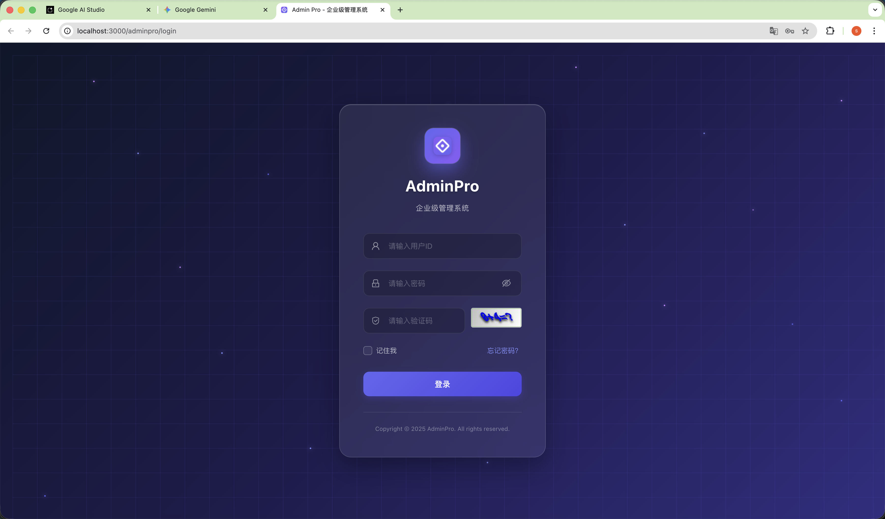
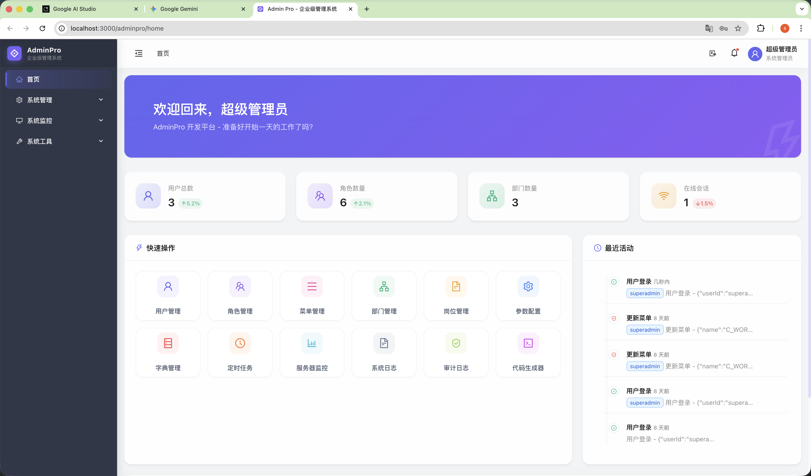
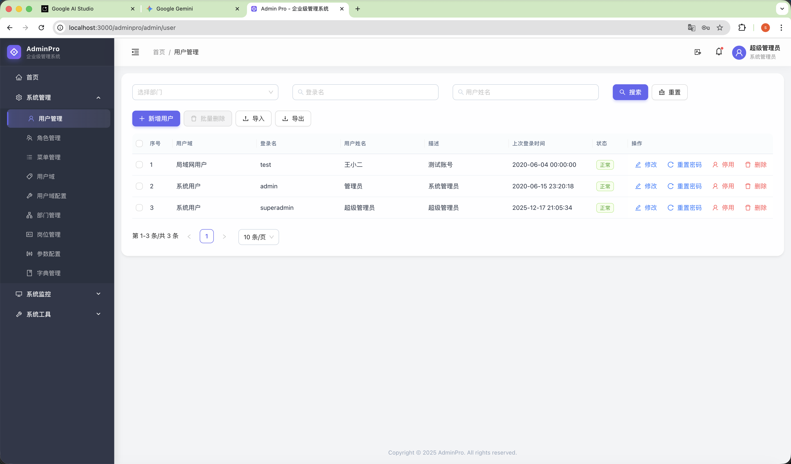
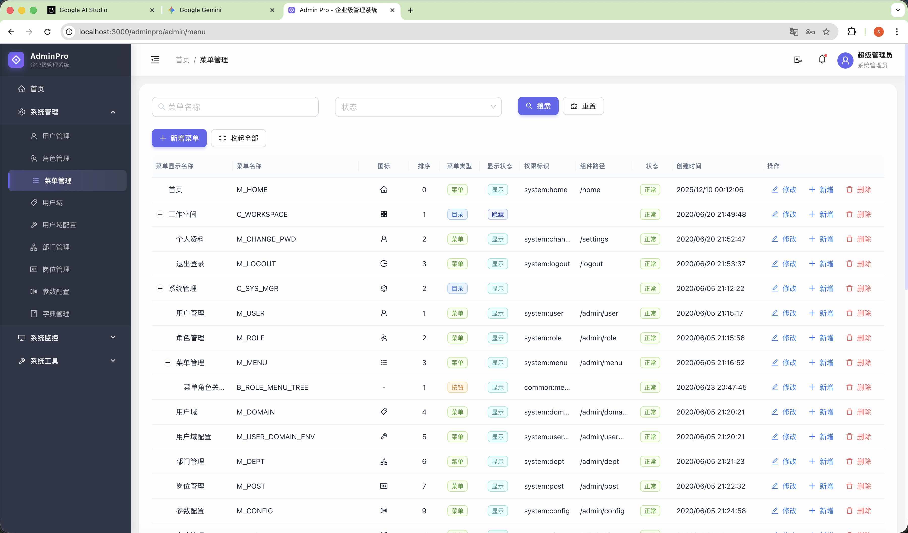

# Admin Pro

<div align="center">
  <h3>现代化企业级权限管理系统</h3>
  <p>Spring Boot 3 + React 19 + TypeScript + Ant Design 5</p>
</div>


## 项目展示

<table>
  <tr>
    <td align="center">
      
      <br />
      <b>登录页</b>
    </td>
    <td align="center">
      
      <br />
      <b>仪表盘</b>
    </td>
  </tr>
  <tr>
    <td align="center">
      
      <br />
      <b>用户管理</b>
    </td>
    <td align="center">
      
      <br />
      <b>菜单管理</b>
    </td>
  </tr>
</table>

## 简介


Admin Pro 是一个稳健的全栈企业级权限管理系统。它采用 Spring Boot 后端与 React 前端分离的架构，提供现代化的"玻璃拟态"（Glassmorphism）UI 设计和完善的 RBAC（基于角色的访问控制）能力。

## 核心功能

- **RBAC 安全**: 完整的用户、角色、菜单和部门管理。
- **现代化 UI**: React 19 + Ant Design 5，搭配自定义"玻璃拟态"主题。
- **强大后端**: Spring Boot 3.5.6, Java 21, MySQL 8.0+。
- **开发工具**: 代码生成器、Swagger 文档、Quartz 定时任务、系统监控。
- **SaaS 就绪**: 支持多租户模式（Domain）。
- **包含门户**: 独立的、SEO 友好的门户网站。

## 技术栈

| 类型 | 技术组件 |
|------|--------------|
| **后端** | Java 21, Spring Boot 3.5, MySQL 8, Redis, Liquibase, Spring Security |
| **前端** | React 19, TypeScript 5.9, Vite 7, Ant Design 5, Zustand, React Router 7 |
| **门户** | React 19, TypeScript, Ant Design 6, i18next |

## 快速开始

### 环境要求
- JDK 21+
- Node.js 18+ & pnpm
- MySQL 8.0+

### 本地开发

1.  **克隆 & 数据库配置**:
    ```bash
    git clone <url>
    # 创建数据库 'adminpro' 并配置 'adminpro-web/src/main/resources/application.yml'
    ```
2.  **启动后端**:
    ```bash
    mvn clean install
    cd adminpro-web && mvn spring-boot:run
    # 服务地址: http://localhost:8080/adminpro
    ```
3.  **启动管理后台**:
    ```bash
    cd frontend && pnpm install && pnpm dev
    # 访问地址: http://localhost:3000
    ```
4.  **登录**:
    - 用户名: `superadmin`
    - 密码: `password$1`

## Docker 部署

使用 Makefile 一键部署:

```bash
make build  # 构建镜像
make up     # 启动服务
```

详细说明请参考 [DOCKER_DEPLOY.md](DOCKER_DEPLOY.md)。

### 环境变量配置

项目支持通过环境变量灵活配置部署参数。在项目根目录创建 `.env` 文件：

#### 前端配置

```bash
# 应用基础路径（前端静态资源和路由的路径前缀）
APP_BASE_PATH=/adminpro

# API 基础路径（前端访问后端 API 的路径）
API_BASE_URL=/api
```

#### 后端配置

```bash
# 后端上下文路径（Spring Boot context-path）
BACKEND_CONTEXT_PATH=/adminpro

# 后端服务端口
BACKEND_PORT=8080
```

#### 数据库配置

```bash
DB_HOST=host.docker.internal
DB_PORT=3306
DB_NAME=adminpro
DB_USERNAME=adminpro
DB_PASSWORD=password$1
```

### API_BASE_URL 工作原理

`API_BASE_URL` 在前端和 Nginx 两个层面同步生效：

1. **前端层**: 所有 API 请求使用此路径（如 `/${API_BASE_URL}/auth/login`）
2. **Nginx 层**: 自动配置代理规则 `location ^~ ${API_BASE_URL}`

**示例**（设置 `API_BASE_URL=/my-api`）：
- 前端发起: `fetch('/${API_BASE_URL}/auth/login')`
- Nginx 代理: `/${API_BASE_URL}/*` → `http://backend:8080/adminpro/*`
- Cookie 路径: `/adminpro` 自动重写为 `/${API_BASE_URL}`

### 常见配置场景

**场景 1: 默认配置**
```bash
APP_BASE_PATH=/adminpro
API_BASE_URL=/api
BACKEND_CONTEXT_PATH=/adminpro
```
- 前端: `http://your-domain/adminpro/`
- API: `http://your-domain/api/*` → 后端: `http://backend:8080/adminpro/*`

**场景 2: 自定义 API 路径**
```bash
APP_BASE_PATH=/admin
API_BASE_URL=/backend-api
BACKEND_CONTEXT_PATH=/adminpro
```
- 前端: `http://your-domain/admin/`
- API: `http://your-domain/backend-api/*` → 后端: `http://backend:8080/adminpro/*`

**场景 3: 根路径部署**
```bash
APP_BASE_PATH=/
API_BASE_URL=/api
BACKEND_CONTEXT_PATH=/
```
- 前端: `http://your-domain/`
- API: `http://your-domain/api/*` → 后端: `http://backend:8080/*`


## OpenClaw 自动化流程

项目当前的 QA → GitHub Issue → Codex 修复协作流程见 [OPENCLAW_QA_ISSUE_WORKFLOW.md](OPENCLAW_QA_ISSUE_WORKFLOW.md)。

## 许可证

[LICENSE](LICENSE)
