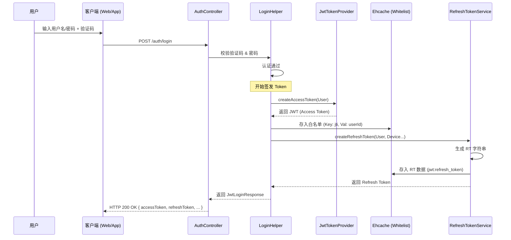
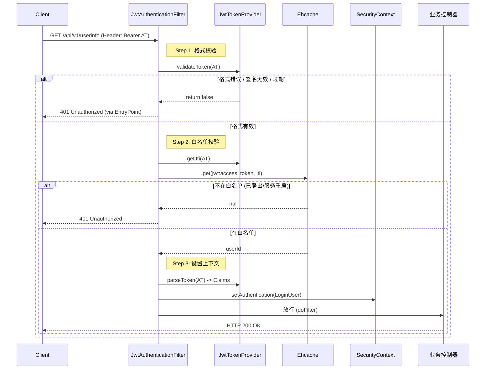
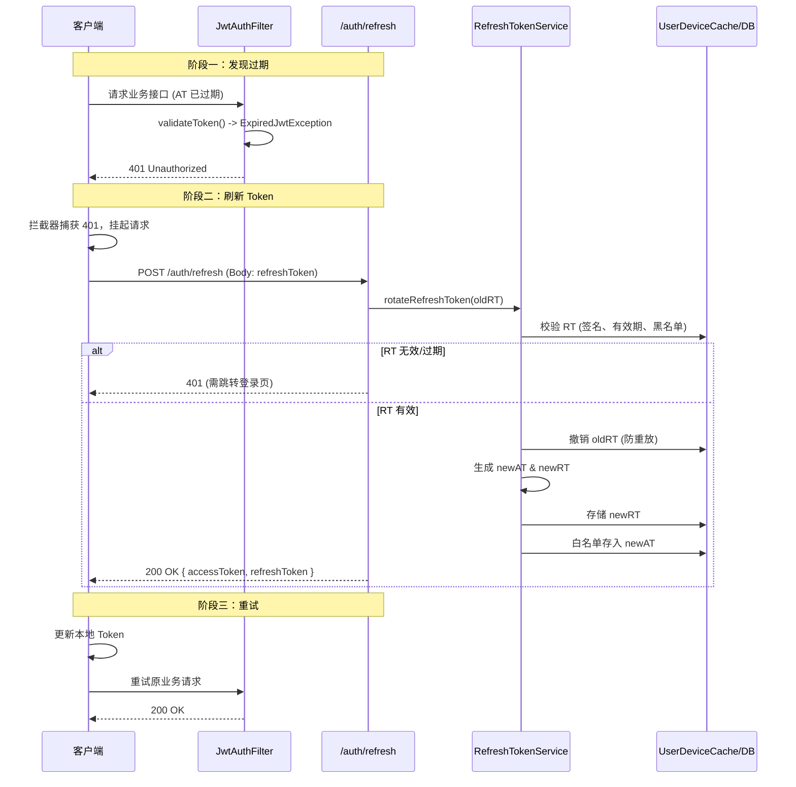
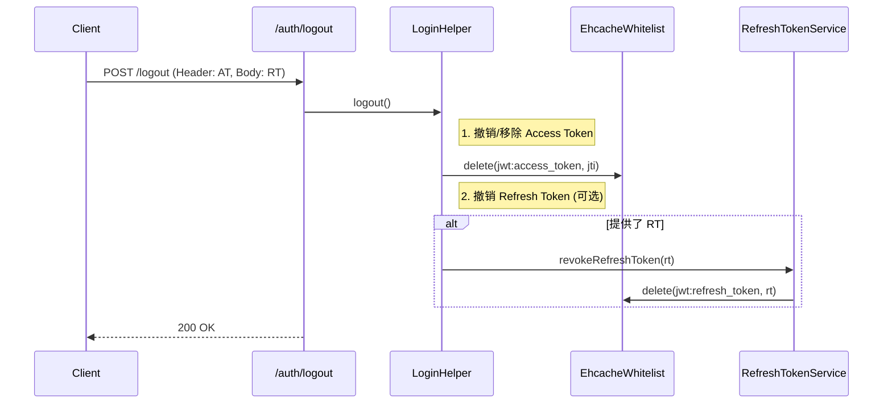

# JWT 认证流程详解

> **文档版本**: v1.0
> **最后更新**: 2026-01-18
> **说明**: 本文档详细描述了 AdminPro 系统的 JWT 认证、Token 刷新及登出流程，作为后续维护和排查问题的参考。

---

## 1. 登录流程 (Login Flow)

登录是获取凭证（Access Token 和 Refresh Token）的起点。系统支持由 `LoginHelper.loginJwt` 统一处理发证逻辑。

### 1.1 时序图

### 1.2 关键点
- **白名单机制**: Access Token 生成后，其 `jti` (ID) **必须** 存入 Ehcache 的 `jwt:access_token` 区域。过滤器会检查此记录。
- **设备绑定**: Refresh Token 会绑定设备信息 (DeviceID, IP, UA)，用于后续安全风控。

---

## 2. API 请求认证流程 (Access Authentication)

客户端携带 Access Token 访问受保护接口时的验证逻辑。

### 2.1 时序图

### 2.2 维护指南
- **401 排查**: 如果用户反馈莫名 401，除了检查 Token 是否过期，还需检查服务端 Ehcache 是否重启（导致白名单丢失）。
- **性能**: 白名单查询是内存操作（Ehcache Heap），性能极高，不会成为瓶颈。

---

## 3. Token 过期与刷新流程 (Token Refresh)

当 Access Token 过期时，使用 Refresh Token 获取新 Token 的流程（无感刷新）。

### 3.1 时序图

### 3.2 关键策略
- **Token 轮换 (Rotation)**: 每次刷新不仅返回新的 AT，也返回新的 RT。旧 RT 立即失效。这能有效防止 RT 泄露后的持续滥用。
- **并发处理**: 前端需做好并发锁，防止同一个页面多个接口同时触发刷新，导致旧 RT 被多次使用（引发"Token已撤销"错误）。

---

## 4. 登出流程 (Logout)

主动注销登录，需同时清理 Access Token 白名单和 Refresh Token。

### 4.1 时序图

### 4.2 说明
- **即时生效**: 由于移除了 Access Token 的白名单，该 AT 即使未过期也无法再通过 `JwtAuthenticationFilter` 的校验。

---

## 5. 异常代码参考

在维护过程中，常见 HTTP 状态码及其含义：

| 状态码 | 场景 | 原因 | 建议处理 |
|:-----:|------|------|----------|
| **200** | 正常 | - | - |
| **401** | 认证失败 | Token 过期、无效、或不在白名单 | 尝试刷新 Token，失败则跳转登录 |
| **403** | 权限不足 | 用户已认证，但无该资源权限 | 提示无权访问 |
| **429** | 频率限制 | 登录/刷新接口请求过频 | 稍后重试 |
